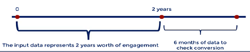
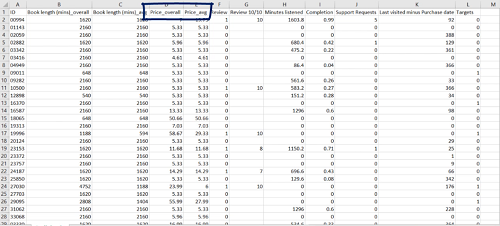
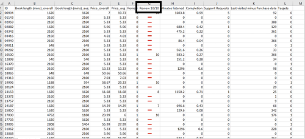
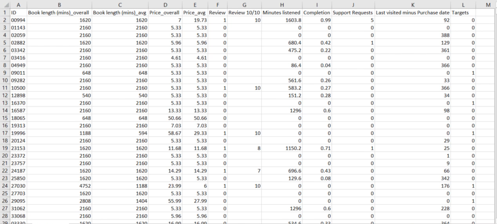

# Project Overview: Predicting if a buyer will make another purchase from an audiobook firm.

Predict if a customer will buy again or not

* Developed a deep learning model that can forecast whether a consumer in the database of an audiobook business would make another purchase or not.

* Every client in the database has made at least one purchase, which is why he or she is in the database.

* The business can save a lot of money if we can concentrate our efforts ONLY on consumers who are likely to convert again.

* We use customer data from the previous years and the next six months. We build the model using two years of data, then wait six months to see who buys again.

* We can forecast which clients will come back with a 81 % level of accuracy.

* This methodology can pinpoint the key performance indicators for repeat business from customers. Finding new clients generates value and business expansion possibilities.

* Because it avoids advertising to consumers who are not likely to buy another audiobook, this is significant for an audiobook company.

## Code and Resources Used

**Python Version:** 3.10.5

**Packages:** pandas, numpy, tensorflow

## Data provided by the company:

* "Customer ID"

* "Book length in mins avg" - this is the ('Book length in minutes sum' / the number of audiobooks the customer has bought)

* "Book length in minutes sum" - this is the sum in minutes of all the audiobooks a customer has bought

* "Price avg" - average of all purchases('Price paid sum' / number of audiobooks the customer has bought)

* "Price paid sum" - sum of all purchases

* "Review" - a Boolean variable(Did the customer leave a review or not?)

* "Review 10/10" - the actual review if the customer left one

* "Total minutes listened"

* "Completion" - percentage of completion of the book(from 0 to 1)

* "Support requests" - number(the number of times the client asked for customer service)

* "Last visited minus purchase date" - The number of days from the first time the customer paid for this service till the last time he last visited it(in days)

## Identifying predictors

After getting the data, I analysed it's features to see how each could impact the decision of the customer to buy or not:

* Since "Customer ID" serves no purpose, it will be eliminated from the model.

* Since "Price avg" and "Price paid sum" are often excellent predictors, we maintain them. Of course, clients who spend more may do so again. We'll find out from the model.

* "Review" and "Review 10/10": They demonstrate platform involvement. I'll bet someone will return if they took the time to give a review.

* "Review 10/10": The average review is used to fill in the gaps in the review column. The majority of the values in this column are missing, therefore if we do not impute it, our model may be skewed.

* "Completion": This is a characteristic that we definitely want in the model. It is better for us if it is larger.

* "Support requests": A large amount of support requests may indicate that a customer is too happy and engages with the business often, or it may indicate the reverse. A crucial component as well

* "Last visited minus purchase date": The higher this number, the better. If a customer's score is zero, it suggests they simply enrolled and abandoned their account.

## Data preprocessing

* I balanced the targets because one target was greater than the other.

* The inputs were standardized via scaling.

* Shuffled the data

* Split the data into train, validation, and test splits then saved them as npz files

## Creating, fitting, and interpreting the model and its results

* Loaded the datasets that were saved.

* The input was 10, the output was 2, and the hidden layer size was 50 for two hidden layers.

* Using "relu" as the hidden layer activation function and "softmax" for the output

* Compiled the model, then fitted it in batches of 100

* To prevent overfitting, I used early stopping callback

## Results

* Accuracy of 81.7%.

* The firm has a 81% success rate in locating repeat clients.

## The dataset
* This is what the dataset looks like

